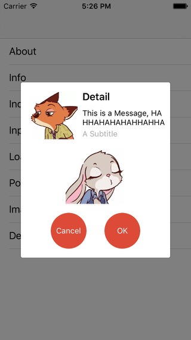
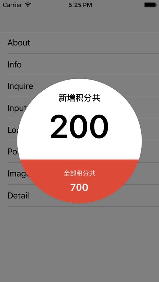
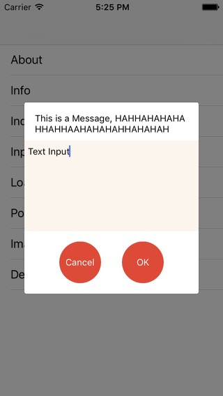
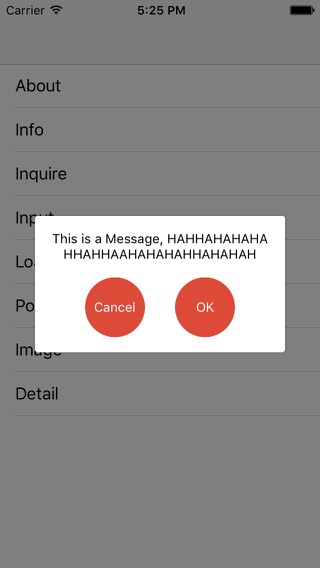
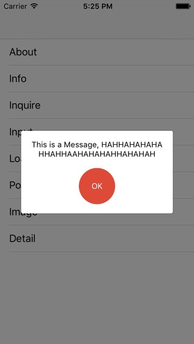
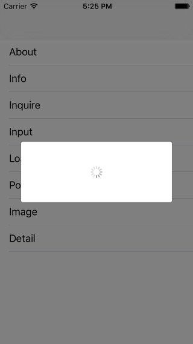

# MXAlert-in-Objective-C

`MXAlert` is a custom alert view.

## Screenshots



## Installation with CocoaPods

```
pod 'MXAlert'
```

## Usage

```
#import "MXAlert.h"
```

Sample Code:

```
MXAlert *alert = [MXAlert inquireAlert];
[alert setMessage:@"This is a Message"];
[alert setPositiveButton:@"OK" onClickListener:^(MXAlertOperation * _Nonnull alertView, NSString * _Nonnull inputString) {
  if ([inputString length]) {
    NSLog(@"Input: %@", inputString);
  }
  [alertView hide];
}];
[alert setNegativeButton:@"Cancel" onClickListener:^(MXAlertOperation * _Nonnull alertView, NSString * _Nonnull inputString) {
  if ([inputString length]) {
    NSLog(@"Input: %@", inputString);
  }
  [alertView hide];
}];
[alert show];
```
